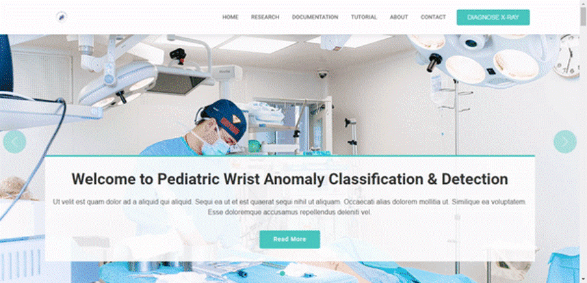
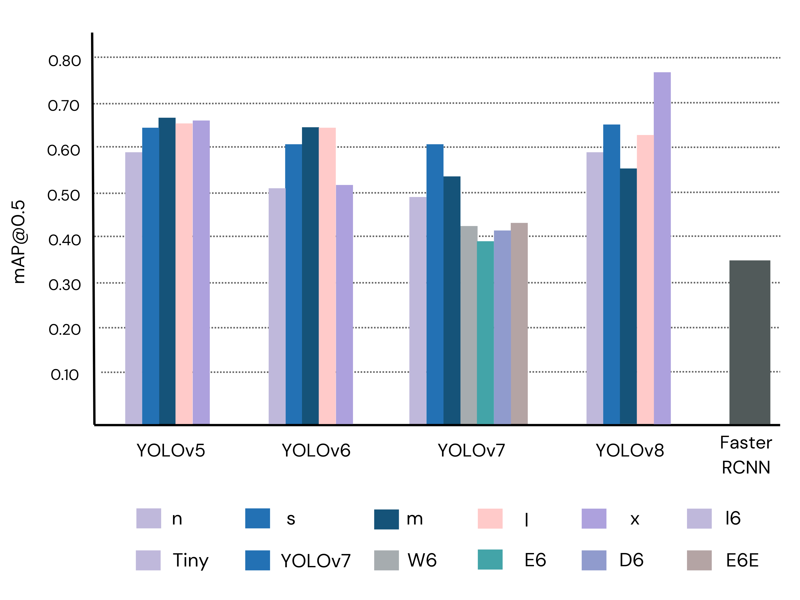

# Pediatric Wrist Abnormality Detection Syste

An application that detect anomalies in the X-Ray image with accuracy.

<div align="center">
  
</div>

## Introduction

The proposed project aims to provide a solution to the scarcity of radiologists and lack of specialized training among medical professionals in diagnosing and treating wrist abnormalities in children, adolescents, and young adults. With the incidence rate of distal radius and ulna fractures being higher during puberty, timely and accurate diagnosis is crucial. To address this, the project aims to provide an automated system using object detection algorithms and computer vision and machine learning techniques, enabling users to easily input pediatric wrist x-ray images and receive an output indicating the presence and location of any anomalies. The system is designed to be user-friendly, providing high accuracy and precision in diagnosis, and accessible through a mobile application without an internet connection. The project aims to reduce the dependency on manual interpretation of x-ray images, which can be time-consuming and subject to errors, and to make the diagnostic process more efficient for both patients and doctors. The research paper further highlights the effectiveness of single-stage deep neural network-based detection models, specifically YOLOv8x, in enhancing pediatric wrist imaging, with a fracture detection mean average precision (mAP) of 0.95 and an overall mAP of 0.77 on the GRAZPEDWRI-DX pediatric wrist dataset. In summary, the project aims to provide an innovative and efficient solution to improve the diagnosis and treatment of wrist abnormalities, ultimately improving patient care and convenience.

## Installation
To run this machine learning project on Flask, you need to follow these steps:

1. Clone the project repository from GitHub:
```bash
git clone https://github.com/ammarlodhi255/pediatric_wrist_abnormality_detection-end-to-end-implementation.git
```

2. Navigate to the project directory:
```bash
cd pediatric_wrist_abnormality_detection-end-to-end-implementation
```

3. Create a virtual environment for the project:
```bash
python3 -m venv env
```

4. Activate the virtual environment:
```bash
source env/bin/activate
```

5. Install the required packages using pip:
```bash
pip install -r requirements.txt
```

6. Export the Flask app:
```bash
export FLASK_APP=app.py
```

7. Run the Flask app:
```bash
flask run
```

The app should now be running on your local machine. You can access it by opening a web browser and navigating to http://localhost:5000.

## Results
In this section, we present a comprehensive analysis of the performance of various models for wrist abnormality detection on the GRAZPEDWRI-DX dataset. We conducted a total of 23 detection procedures using different variants of each YOLO model and a two-stage detection model (Faster R-CNN) on a test set consisting of 1016 randomly selected samples. The performance of each model was evaluated using metrics such as precision, recall, and mean average precision (mAP).

Below are the [weights](#weights_yolov8) of the YOLOv8 model along with their corresponding results:

### YOLOv8 Weights

| Model variants<a name="weights_yolov8"></a>                                          | size<br><sup>(pixels) | Precision | Recall | mAP@0.5 | mAP@0.5:0.95 |
| ------------------------------------------------------------------------------------ | --------------------- | ----------|--------|---------|--------------|
| [YOLOv8n](https://github.com/AbdulManaf12/FYP-Project/releases/download/v0.0.0/YOLOv8n.pt) | 640             | 0.73 	   | 0.58 	| 0.59    | 0.36         |         
| [YOLOv8s](https://github.com/AbdulManaf12/FYP-Project/releases/download/v0.0.0/YOLOv8s.pt) | 640             | 0.72 	   | 0.63 	| 0.65    | 0.39         |     
| [YOLOv8m](https://github.com/AbdulManaf12/FYP-Project/releases/download/v0.0.0/YOLOv8m.pt) | 640             | 0.60 	   | 0.60 	| 0.56    | 0.36         |     
| [YOLOv8l](https://github.com/AbdulManaf12/FYP-Project/releases/download/v0.0.0/YOLOv8l.pt) | 640             | 0.74 	   | 0.60 	| 0.62    | 0.41         |     
| [YOLOv8x](https://github.com/AbdulManaf12/FYP-Project/releases/download/v0.0.0/YOLOv8x.pt) | 640             | 0.79 	   | 0.64 	| 0.77    | 0.53         |  

Presented below is a summary of the mean average precision (mAP) scores achieved by all YOLO variants and Faster R-CNN, for both the fracture class and all classes combined.
<div align="center">
  
</div>

  
## Acknowledgement
We would like to express our sincere appreciation and gratitude to all those who have supported and contributed to the development and success of our project, "Pediatric Wrist Abnormality Detection System".

First and foremost, we would like to thank our project supervisor, Dr. Sher Muhammad Daudpota, for his guidance, support, and expertise throughout the project. His valuable insights and feedback have been instrumental in shaping our research and system development.

We also extend our thanks to Mam Faryal Shamsi, Saif Hassan, and Babar Shah, the members of our internal committee, for their valuable input and feedback during the project's development.

We would also like to thank our research supervisors, Dr. Sher Muhammad Daudpota (Sukkur IBA, Pakistan), Ali Shariq (NTNU Norway), and Zenun Kastrati (LNU Sweden), for their support and encouragement throughout our research and development process.

Finally, we would like to acknowledge our fellow team member, Abdul Manaf, for his contributions and collaboration throughout the project.

We also extend our thanks to all those who have provided resources and support to us during the project, including open-source libraries, datasets, and software.

Thank you all for your invaluable contributions and support.

## Contact Info
For any questions or feedback regarding this project, please feel free to contact the authors:
* Ammar Ahmed \
     LinkedIn: https://www.linkedin.com/in/ammar-ahmed68/ \
     Email: ammarlodhi68@gmail.com
* Abdul Manaf \
     LinkedIn: https://www.linkedin.com/in/abdul-manaf-6493a3188/ \
     Email: abdulmanafsahito@gmail.com
