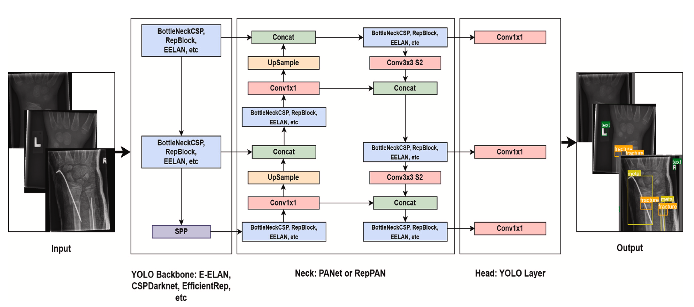

# Pediatric Wrist Abnormality Detection

[](https://paperswithcode.com/sota/object-detection-on-grazpedwri-dx?p=enhancing-wrist-abnormality-detection-with)



-------------------
Journal Paper URL: [Enhancing wrist abnormality detection with YOLO: Analysis of state-of-the-art single-stage detection models](https://www.sciencedirect.com/science/article/pii/S1746809424002027) 

----------------
Arxiv URL: [Enhancing Wrist Fracture Detection with YOLO](https://arxiv.org/abs/2407.12597)

The proposed project aims to provide a solution to the scarcity of radiologists and the lack of specialized training among medical professionals in diagnosing and treating wrist abnormalities in children, adolescents, and young adults. With the incidence rate of distal radius and ulna fractures being higher during puberty, timely and accurate diagnosis is crucial. To address this, the project aims to provide an automated system using object detection algorithms and computer vision and machine learning techniques, enabling users to easily input pediatric wrist X-ray images and receive an output indicating the presence and location of any anomalies. The system is designed to be user-friendly, providing high accuracy and precision in diagnosis, and accessible through a mobile application without an internet connection. The project aims to reduce the dependency on manual interpretation of X-ray images, which can be time-consuming and subject to errors, and to make the diagnostic process more efficient for both patients and doctors. The research paper further highlights the effectiveness of single-stage deep neural network-based detection models, specifically YOLOv8x, in enhancing pediatric wrist imaging, with a fracture detection mean average precision (mAP) of 0.95 and an overall mAP of 0.77 on the GRAZPEDWRI-DX pediatric wrist dataset. In summary, the project aims to provide an innovative and efficient solution to improve the diagnosis and treatment of wrist abnormalities, ultimately improving patient care and convenience.

## Installation

To run this machine learning project on Flask, you need to follow these steps:

1. Clone the project repository from GitHub:

```bash
git clone https://github.com/ammarlodhi255/pediatric_wrist_abnormality_detection-end-to-end-implementation.git
```

2. Navigate to the project directory:

```bash
cd pediatric_wrist_abnormality_detection-end-to-end-implementation
```

3. Create a virtual environment for the project:

```bash
python3 -m venv env
```

4. Activate the virtual environment:

```bash
source env/bin/activate
```

5. Install the required packages using pip:

```bash
pip install -r requirements.txt
```

6. Export the Flask app:

```bash
export FLASK_APP=app.py
```

7. Run the Flask app:

```bash
flask run
```

The app should now be running on your local machine. You can access it by opening a web browser and navigating to http://localhost:5000.

## Results

 We conducted a total of 23 detection procedures using different variants of each YOLO model and a two-stage detection model (Faster R-CNN) on a test set consisting of 1016 randomly selected samples. The performance of each model was evaluated using metrics such as precision, recall, and mean average precision (mAP).

Below are the [weights](#weights_yolov8) of the YOLOv8 model along with their corresponding results:

### YOLOv8 Weights

| Model variants<a name="weights_yolov8"></a>                                                | size<br><sup>(pixels) | Precision | Recall | mAP@0.5 | mAP@0.5:0.95 |
| ------------------------------------------------------------------------------------------ | --------------------- | --------- | ------ | ------- | ------------ |
| [YOLOv8n](https://github.com/AbdulManaf12/FYP-Project/releases/download/v0.0.0/YOLOv8n.pt) | 640                   | 0.73      | 0.58   | 0.59    | 0.36         |
| [YOLOv8s](https://github.com/AbdulManaf12/FYP-Project/releases/download/v0.0.0/YOLOv8s.pt) | 640                   | 0.72      | 0.63   | 0.65    | 0.39         |
| [YOLOv8m](https://github.com/AbdulManaf12/FYP-Project/releases/download/v0.0.0/YOLOv8m.pt) | 640                   | 0.60      | 0.60   | 0.56    | 0.36         |
| [YOLOv8l](https://github.com/AbdulManaf12/FYP-Project/releases/download/v0.0.0/YOLOv8l.pt) | 640                   | 0.74      | 0.60   | 0.62    | 0.41         |
| [YOLOv8x](https://github.com/AbdulManaf12/FYP-Project/releases/download/v0.0.0/YOLOv8x.pt) | 640                   | 0.79      | 0.64   | 0.77    | 0.53         |

Presented below is a summary of the mean average precision (mAP) scores achieved by all YOLO variants and Faster R-CNN, for both the fracture class and all classes combined.

<div align="center">
  
</div>

## Acknowledgement
* This work was supported in part by the Department of Computer Science (IDI), Faculty of Information Technology and Electrical Engineering, Norwegian University of Science and Technology (NTNU), Gjøvik, Norway; and in part by the Curricula Development and Capacity Building in Applied Computer Science for Pakistani Higher Education Institutions (CONNECT), Project number: NORPART-2021/10502, funded by DIKU.


## Citation

```bibtex
@article{ahmed2024enhancing,
  title={Enhancing wrist abnormality detection with YOLO: Analysis of state-of-the-art single-stage detection models},
  author={Ahmed, A. and Imran, A. S. and Manaf, A. and Kastrati, Z. and Daudpota, S. M.},
  journal={Biomedical Signal Processing and Control},
  volume={93},
  pages={106144},
  year={2024},
  month={Jul},
  doi={10.1016/j.bspc.2024.106144}
  url={https://www.sciencedirect.com/science/article/pii/S1746809424002027}
}
```
